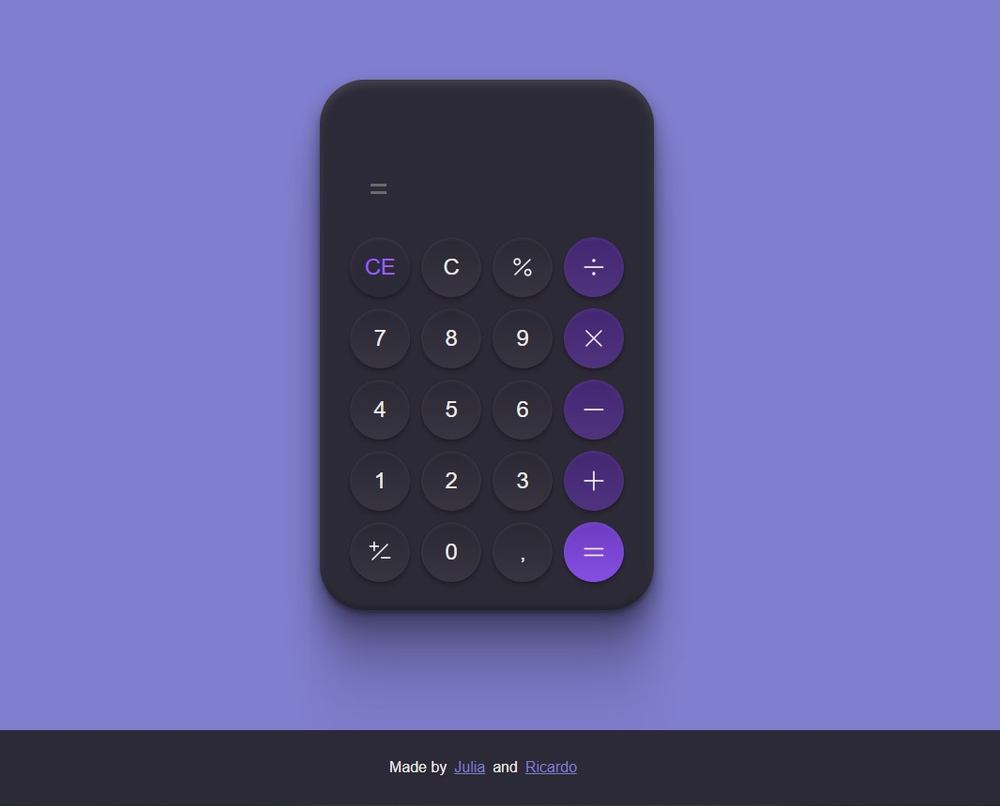

<h1 align="center"> #5 My Calculator </h1>

Esta calculadora é o #5 desafio <a href="https://boracodar.dev/">#BORACODAR</a> da RocketSeat 

  <a href="#-tecnologias">Tecnologias</a>&nbsp;&nbsp;&nbsp;|&nbsp;&nbsp;&nbsp;
  <a href="#-projeto">Projeto</a>&nbsp;&nbsp;&nbsp;|&nbsp;&nbsp;&nbsp;
  <a href="#-layout">Layout</a>&nbsp;&nbsp;&nbsp;|&nbsp;&nbsp;&nbsp;
  <a href="#-collaborators">Collaborators</a>&nbsp;&nbsp;&nbsp;|&nbsp;&nbsp;&nbsp;

 

  

## 🚀 Tecnologias

Esse projeto foi desenvolvido com as seguintes tecnologias:

- HTML
- CSS
- JavaScript
- React
- Git e Github
- Figma

## 💻 Projeto

O projeto _My Calculator_ foi realizado como parte do desafio #BORACODAR da RocketSeat sugerido pelo professor <a href="https://github.com/maykbrito" alt="Link para o GitHub do professor Mayk Brito" target="_blank">Mayk Brito</a>.

  Funcionalidade

Esta calculadora opera basicamente como qualquer outra calculadora, podendo ser utilizada com números inteiros e float incluindo as funções mais comumente usadas, tais como:

- Soma
- Subtração
- Multiplicação
- Divisão

Além dessas operações ela conta com duas funcionalidades mais específicas, o botão "+/-" que serve para tornar um número negativo ou positivo, e o botão "%" o qual explicarei na sequência.

  Funcionamento do operador "%"

Para encontrar a porcentagem de um número, digite o número, aperte a tecla "x" (multiplicação), digite outro número referente a porcentagem desejada e, em seguida, pressione a tecla "%".

Por exemplo, 18% de 100 é calculado pressionando-se:

  100 x 18 %

Resultando em 18 como valor final no display.

Já para encontrar o desconto ou acréscimo percentual de um valor, o valor deve ser digitado em seguida deve-se pressionar a tecla "+" para o acréscimo ou "-" para o desconto, e em seguida pressionar "%".

Por exemplo, 18% de acréscimo no valor de 100 é calculado pressionando-se:

  100 + 18 %

Resultando em 118 como valor final no display.

- <a href="https://mycalculator-juh-rick.vercel.app/" target="_blank">Visite o projeto online</a>

## 🔖 Layout

Você pode visualizar o layout proposto pela RocketSeat através do [LINK](https://www.figma.com/community/file/1202607074523509182). É necessário ter conta no [Figma](https://figma.com) para acessá-lo.

## 📃 Collaborators

This challange was made by [Julia](https://gsajulia.github.io) and [Ricardo](https://rickazuo.github.io/portfolio/)
